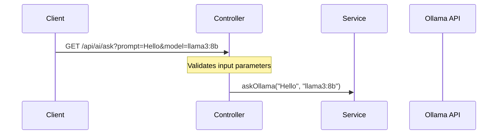
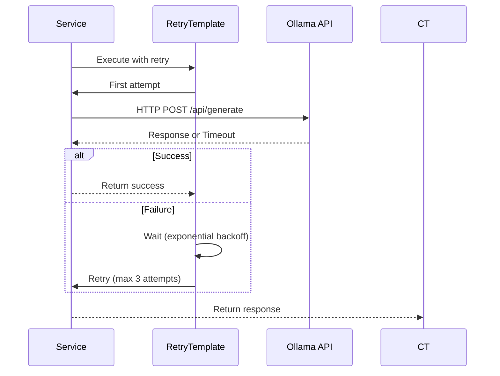

# Ollama AI Chat Application

A Spring Boot-based web application that provides a chat interface to interact with various Ollama AI models. This project demonstrates modern Java/Spring Boot development practices, including REST API design, error handling, retry mechanisms, and configuration management.

## 📋 Project Overview

This application serves as a backend service that:
- Exposes a REST API for interacting with Ollama AI models
- Implements robust error handling and retry mechanisms
- Demonstrates clean architecture principles
- Provides configurable settings for different deployment scenarios

### 🔍 Key Concepts Demonstrated
1. **Spring Boot REST API Development**
2. **Retry Mechanisms with Spring Retry**
3. **Configuration Management**
4. **Exception Handling**
5. **Dependency Injection**
6. **API Documentation (via code comments)

## 🚀 Features

- Interactive chat interface
- Multiple AI model support (switchable from UI)
- Persistent model selection using localStorage
- Responsive design
- Error handling and retry mechanism
- Configurable timeouts
- Real-time status updates

## 🏗️ Detailed Architecture

### High-Level Architecture
```
┌─────────────┐    ┌─────────────────────────────────────┐    ┌───────────────┐
│   Client    │───▶│        Spring Boot App             │───▶│   Ollama      │
│ (Browser/   │◀───│  ┌───────────┐     ┌───────────┐   │◀───│   API         │
│  Postman)   │    │  │ Controller│◄───►│  Service  │   │    └───────────────┘
└─────────────┘    │  └───────────┘     └───────────┘   │
                   │          ▲                ▲         │
                   │          │                │         │
                   │  ┌───────┴─────┐  ┌──────┴──────┐  │
                   │  │  Retry     │  │  Validation  │  │
                   │  │  Mechanism  │  │  & Error     │  │
                   │  └─────────────┘  └──────────────┘  │
                   └─────────────────────────────────────┘
```

### Component Details

#### 1. Controller Layer (`OllamaController.java`)
- **Responsibility**: Handle HTTP requests and responses
- **Key Features**:
  - REST endpoint for AI queries (`/api/ai/ask`)
  - Request validation
  - Error handling with proper HTTP status codes
  - Clean separation of concerns

#### 2. Service Layer (`OllamaService.java`)
- **Responsibility**: Business logic and external API communication
- **Key Features**:
  - Retry mechanism for transient failures
  - Timeout configuration
  - Model selection
  - Response processing

#### 3. Configuration (`RetryConfig.java`)
- **Responsibility**: Application-wide configuration
- **Key Features**:
  - Retry policy with exponential backoff
  - Configurable through properties
  - Clean separation of configuration from business logic

## 🛠️ Setup and Installation

### Prerequisites
- Java 17 or higher
- Maven
- Node.js (for frontend assets if needed)
- Ollama installed and running locally

### Installation Steps
1. Clone the repository
   ```bash
   git clone <repository-url>
   cd demo_ollama
   ```

2. Build the application
   ```bash
   mvn clean install
   ```

3. Start the application
   ```bash
   mvn spring-boot:run
   ```

4. Access the application at `http://localhost:8080`

## ⚙️ Configuration

Configuration is managed through `application.properties`:

```properties
# Server Configuration
server.port=8080

# Ollama API Configuration
ollama.api.url=http://localhost:11434/api/generate
ollama.model=deepseek-coder:1.3b  # Default model
ollama.timeout.seconds=300       # 5 minutes timeout
```

## 🔄 API Endpoints

### `GET /api/ai/ask`
Sends a prompt to the AI model and returns the response.

**Query Parameters:**
- `prompt` (required): The input text for the AI
- `model` (optional): The AI model to use (default: llama3:8b)

**Example Request:**
```
GET /api/ai/ask?prompt=Hello%20world&model=llama3:8b
```

**Success Response (200 OK):**
```json
"Hello! How can I assist you today?"
```

## 🏗️ Project Structure & Code Walkthrough

```
src/
├── main/
│   ├── java/
│   │   └── com/example/ollamaAi/demo_ollama/
│   │       ├── config/                  # Configuration classes
│   │       │   └── WebConfig.java       # Web-specific configurations
│   │       │
│   │       ├── DemoOllamaApplication.java  # Main application class
│   │       ├── OllamaController.java      # REST Controller (API endpoints)
│   │       ├── OllamaService.java         # Core business logic
│   │       └── RetryConfig.java           # Retry mechanism configuration
│   │
│   └── resources/
│       ├── static/                      # Frontend assets
│       │   ├── css/                    # Stylesheets
│       │   ├── js/                     # Client-side JavaScript
│       │   └── index.html              # Main HTML file
│       └── application.properties       # Application configuration
```

### Key Files Explained

#### 1. `OllamaController.java`
- **Purpose**: Handles HTTP requests and responses
- **Key Methods**:
  - `ask(String prompt, String model)`: Main endpoint handler
  - `handleTypeMismatch()`: Global exception handler
- **Interview Talking Points**:
  - REST API design principles
  - Exception handling strategies
  - Request validation
  - Response entity usage

#### 2. `OllamaService.java`
- **Purpose**: Contains business logic and external API communication
- **Key Features**:
  - `@Retryable` for automatic retries
  - Configurable timeouts
  - Model selection logic
- **Interview Talking Points**:
  - Retry patterns
  - Timeout handling
  - External service integration
  - Thread safety considerations

#### 3. `RetryConfig.java`
- **Purpose**: Configures retry behavior
- **Key Components**:
  - `RetryTemplate` with exponential backoff
  - Configurable retry policies
- **Interview Talking Points**:
  - Circuit breaker vs retry patterns
  - Backoff strategies
  - Configuration best practices

## 🔄 Detailed Flow of Execution

### 1. Request Initiation


### 2. Service Layer Processing


### 3. Response Flow
1. **Success Path**:
   - Service receives response from Ollama
   - Processes and returns the response
   - Controller wraps in ResponseEntity with 200 OK

2. **Error Path**:
   - If validation fails: 400 Bad Request
   - If service fails after retries: 500 Internal Server Error
   - If request times out: 504 Gateway Timeout

### 4. Retry Mechanism
- **Max Attempts**: 3 (initial + 2 retries)
- **Backoff**: Exponential (1s, 2s, 4s)
- **Max Delay**: 10 seconds between retries
- **Retry On**: SocketTimeoutException, IOException

## 🔍 Interview Questions & Answers

### 1. How does the retry mechanism work in this application?
**Answer**:
The application uses Spring Retry with the following configuration:
- **Max Attempts**: 3 (1 initial + 2 retries)
- **Backoff Policy**: Exponential (1s, 2s, 4s)
- **Max Delay**: 10 seconds between retries
- **Retry Conditions**: SocketTimeoutException and IOException

Implementation:
```java
@Retryable(
    value = {SocketTimeoutException.class, IOException.class},
    maxAttempts = 3,
    backoff = @Backoff(delay = 1000, multiplier = 2)
)
public String askOllama(String prompt, String model) {
    // Implementation
}
```

### 2. How would you handle rate limiting from the Ollama API?
**Answer**:
To handle rate limiting, I would:
1. Implement a circuit breaker pattern using Resilience4j
2. Add rate limit headers to responses
3. Implement a token bucket or leaky bucket algorithm
4. Add proper HTTP 429 (Too Many Requests) handling

### 3. How is configuration managed in this application?
**Answer**:
Configuration is managed through:
1. `application.properties` for environment-agnostic settings
2. `@Value` annotations for property injection
3. `@Configuration` classes for bean definitions
4. Environment variables for sensitive data

### 4. How would you improve the error handling?
**Answer**:
Improvements could include:
1. Custom exception hierarchy
2. Global exception handler with `@ControllerAdvice`
3. Detailed error responses with error codes
4. Structured logging for better debugging
5. Circuit breaker pattern for cascading failures

### 5. How does the application handle concurrent requests?
**Answer**:
- Spring's default thread-per-request model
- Stateless services ensure thread safety
- Connection pooling for HTTP client
- Timeout configurations prevent resource exhaustion

## 📦 Dependencies & Technical Stack

### Backend
- **Spring Boot 3.x**: Core framework
- **Spring Web**: REST API support
- **Spring Retry**: Retry mechanism
- **Lombok**: Boilerplate reduction
- **Jackson**: JSON processing
- **JUnit 5 & Mockito**: Unit testing
- **Spring Boot DevTools**: Development tools

### Frontend
- HTML5, CSS3, JavaScript
- Fetch API for AJAX calls
- Responsive design

### Development Tools
- Maven: Build tool
- Git: Version control
- IDE: IntelliJ IDEA or VS Code

## 🚀 Future Enhancements & Scaling

### Short-term
- [ ] Add API documentation with Swagger/OpenAPI
- [ ] Implement request/response logging
- [ ] Add health check endpoint
- [ ] Unit test coverage improvement

### Medium-term
- [ ] Add user authentication (JWT/OAuth2)
- [ ] Implement conversation history with database
- [ ] Add rate limiting
- [ ] Containerization with Docker

### Long-term
- [ ] Add WebSocket support for real-time updates
- [ ] Implement model performance metrics
- [ ] Add support for file uploads and processing
- [ ] Multi-tenant support

## 📚 Learning Resources

1. **Spring Boot Documentation**: https://spring.io/projects/spring-boot
2. **Ollama API Documentation**: https://ollama.ai/docs
3. **REST API Best Practices**: https://restfulapi.net/
4. **Spring Retry**: https://docs.spring.io/spring-batch/docs/current/reference/html/retry.html
5. **Microservices Patterns**: https://microservices.io/patterns/

## 🤝 Contributing

1. Fork the repository
2. Create a feature branch
3. Commit your changes
4. Push to the branch
5. Create a new Pull Request

## 📝 License

This project is licensed under the MIT License - see the [LICENSE](LICENSE) file for details.

## 📝 License

This project is licensed under the MIT License - see the [LICENSE](LICENSE) file for details.
"# Offline_Ollama-Inference" 
